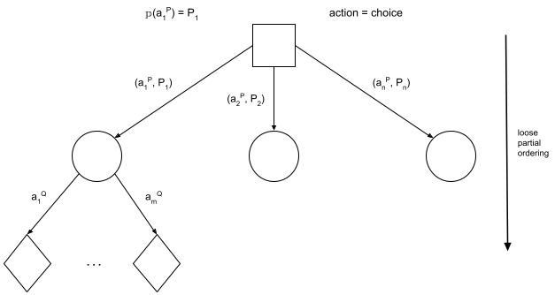

# Summary: Agent Reasoning
Today we looked at examples of game theory, and expanded game theory into decision theory, as well as beginning to look at epistemic logic through  the three hats problem.

Looking at design patterns in artificial intelligence and machine learning, most tasks come down to alternating between computing an expected value and making a choice that maximizes some function (which itself can be composed of other functions depending on complexity).  We compute expected values because they are summary information.  They are useful when we don't know the point value (due to aleatory or epistemic uncertainty) but we do know the distribution.  With this information, we can use the expected value to make decisions.

## Game Theory: Recipe for mixed strategies
In order to find a player's chance of taking a particular action, we use the following "recipe":

1. Compute Expression for E[P|Q=q] using P's utility function
  1. This will be over all possible choices for P
  2. The pmf comes from P's choice
  3. Q's choice is fixed
2. Compute expression for other values of Q=q
3. Set expressions equal to each other and solve for p.

### An Example of Game Theory

EU[E|O=1] = 2p + (-3)(1-p)
= 2p - 3 + 3p
= 5p - 3

EU[E|O=2] = (-3)p + (4)(1-p)
= -3p + 4 - 4p
= -7p + 4

Set equal EU[E|O=1] = EU[E|O=2]
5p - 3 = -7p + 4
12p = 7
p = 7/12

Can also be looked at as min{EU[E|O=1],EU[E|O=2]}

d = |EU[E|O=1] - EU[E|O=2]|
0 = |12p - 7|
0 = 12p - 7       0 = -12p + 7
p = 7/12          p = 7/12

Can also be solved using derivatives, min or max on EU[E]

EU[E] = 2pq +(-3)(1-p)(q) + (-3)(p)(1-q) + (4)(1-p)(1-q)
= 4 + p - 7q + 12pq

p -> set this to max/min
q -> independent

d/dq (EU[E]) = d/dq(4+p - 7q + 12pq)
0 = -7 + 12p
p = 7/12

## Modeling Game Theory as Decision Theory
Agents here are all "rational": So long as they have complete knowledge of the payoff matrix, they will seek to maximize their utility.  The assumption we make is that all players are treating the game in a decision-theoretic manner.  Given that agent's actions are made simultaneously and without coordination or communication between the agents, we can treat the other agent's (Player Q's) actions as random state.  Then each state node encapsulates all the uncertainty about those actions, so we can use game theory to determine the state distribution.

## Minimax theorem in Game Theory
For planning with logic, we search through the change state a logical inference over limited language while enforcing constraints.  We used heuristics and cost, with heuristics being estimates (used when it's alright to be slightly sub-optimal) while costs assign value to the state (used for ordering).  In the past, we used this deterministically while with game theory it is probabilistic.  In game theory, there is a choice in objective between minimizing max loss and maximizing minimum gain.  To solve this, we assume a zero sum game where a player maximizing their min gain is equal to minimizing the max loss.  

In game theory, decisions are being made locally.  As such, we are looking for an optimal decision as optimal is local (which can be controlled), whereas optimum cannot be controlled as it is global.  For these zero-sum games in game theory, there is a saddle point: the minimum between choices for P and maximum between choices for Q is what we want.

## 3 Hats Problem
Looking at other models, we can formalize with epistemic knowledge.  An example of this is the three hats problem, a famous puzzle.  Here, we have 3 people wearing hats.  In total, there are 3 red hats and 2 white hats available.  We put a hat on each person without them seeing what hat they are wearing.  They can see what hat the other people are wearing.  When then ask if the agents (people wearing the hats) know what hat they are wearing.  We can then look at the knowledge that each person has, looking at all the states (here W means a white hat and R means a red hat):
WWR
WRW
RWW
WRR
RWR
RRW
RRR

In some of these states, it is possible for some agents to eventually know what hat they are wearing using their knowledge of the others' hats and eventually the others' knowledge of their own hats, whereas in others (such as RRR), none can figure out what hat they are wearing.  More information can be found online: [Wikipedia description](https://en.wikipedia.org/wiki/Induction_puzzles#The_King's_Wise_Men_Hat_Puzzle), [The three colour hat guessing game on cycle graphs](https://www.combinatorics.org/ojs/index.php/eljc/article/view/v24i1p37/pdf).
